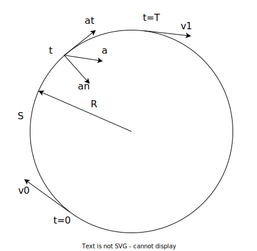

### Zadání

Vlak se pohybuje po kruhové dráze o poloměru **800 m**. V počátečním okamžiku měl vlak rychlost **54 km/h** a v koncovém **18 km/h**. Mezi počátečním a koncovým okamžikem vlak urazil **800 m**. Určete: dobu potřebnou k uražení této dráhy a velikost zrychlení v počátečním a koncovém okamžiku.

- $R = 800 \text{ m}$
- $v_{0} = 54 \text{ km/h}$
- $v_{1} = 18 \text{ km/h}$
- $S = 800 \text{ m}$
- $T = ?$
- $a_{0} = ?$
- $a_{1} = ?$

- $a = \sqrt{ a_{t}^2 + a_{n}^2 }$
- $a_{t} = \text{konst.}$ (křivočarý pohyb rovnoměrně zrychlený)
- $\displaystyle a_{n} = \frac{v^2}{R} = \frac{v_{0}^2}{R}, \frac{v_{1}^2}{R}$

### Výpočet

- $v = a_{t} \cdot t + v_{0}$
- $s = \frac{1}{2}a_{t} \cdot t^2 + v_{0} \cdot t + s_{0}$
+ pro $t = 0 \implies s_{0} = 0$
+ $v = a_{t} \cdot t + v_{0}$
+ $s = \frac{1}{2}a_{t} \cdot t^2 + v_{0} \cdot t$
- pro $t = T$
- $v_{1} = a_{t} \cdot T + v_{0}$
- $s = \frac{1}{2}a_{t} \cdot T^2 + v_{0} \cdot T$
+ $T = \frac{v_{1}-v_{0}}{a_{t}}$

---

$\displaystyle s = \frac{1}{2}\cancel{a_{t}} \cdot \frac{(v_{1} - v_{2})^T}{a_{t}^{\cancel{2}}} + v_{0} \cdot \frac{v_{1} - v_{0}}{a_{t}} = \frac{v_{1}^2 - 2v_{1}v_{0} + v_{0}^2}{2a_{t}} + \frac{v_{0}v_{1} - v_{0}^2}{a_{t}} = \frac{v_{1}^2 - \cancel{2v_{1}v_{0}} + \cancel{v_{0}^2} + \cancel{2v_{1}v_{0}} - \cancel{2}v_{0}^2}{2a_{t}} = \frac{v_{1}^2 - v_{0}^2}{2a_{t}}$

$\displaystyle T = \frac{v_{1} - v_{0}}{\frac{v_{1}^2 - v_{0}^2}{2s}} = \frac{v_{1} - v_{0}}{v_{1}^2 - v_{0}^2} \cdot 2s = \frac{\cancel{v_{1} - v_{0}}}{\cancel{(v_{1} - v_{0})}(v_{1} + v_{0})} \cdot 2s = \frac{2s}{v_{1} + v_{0}}$

$a_{0} = \sqrt{ \left(\frac{v_{1}^2 - v_{0}^2}{2s}\right)^2 + \left(\frac{v_{0}^2}{R}\right)^2 }$

$a_{1} = \sqrt{ \left(\frac{v_{1}^2 - v_{0}^2}{2s}\right)^2 + \left(\frac{v_{1}^2}{R}\right)^2 }$

- $v_{0} = 54 \text{ km/h} = 15 \text{ m/s}$
- $v_{1} = 18 \text{ km/h} = 5 \text{ m/s}$

$a_{t} = \frac{5^2 - 15^2}{2 \cdot 800} \text{ m}\cdot\text{s}^{-2} = \frac{25 - 225}{1600} \text{ m}\cdot\text{s}^{-2} = -\frac{200}{1600} \text{ m}\cdot\text{s}^{-2} = -0.125 \text{ m}\cdot\text{s}^{-2}$
- mínus, takže vektor míří opačným směrem

### Výsledek

$T = \frac{800}{5 + 15}\cdot 2s = \frac{1600}{20}s = 80s$

$a_{0} = \sqrt{ (-0.125)^2 + \left(\frac{15^2}{800}\right)^2 } \text{ m}\cdot\text{s}^{-2} = 0.308 \text{ m}\cdot\text{s}^{-2}$

$a_{1} = \sqrt{ (-0.125)^2 + \left(\frac{5^2}{800}\right)^2 } \text{ m}\cdot\text{s}^{-2} = 0.129 \text{ m}\cdot\text{s}^{-2}$