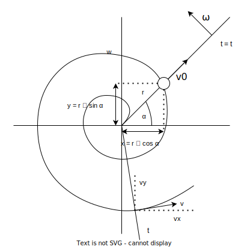

### Zadání

Podél rovnoměrně se otáčející tyče se od jejího upevnění rovnoměrně pohybuje kulička. Určete: **parametrické rovnice dráhy kuličky**, **velikost rychlosti kuličky** a její **celkové**, **tečné** a **normálové zrychlení**.

- $\omega = \text{konst.}$ (úhlová rychlost, rotace tyče)
- $v_{0} = \text{konst.}$ (rychlost kuličky podél tyče)
- parametrická rovnice trajektorie kuličky = ?
- velikost rychlosti kuličky v = ?
- celkové ($a = \ ?$), tečné ($a_{t} = \ ?$) a normálové ($a_{n} = \ ?$) zrychlení

### Výpočet

**Parametrické rovnice dráhy kuličky**
- $\alpha = \omega \cdot t, \quad r = v_{0}\cdot t$
- $x = r \cdot \cos \alpha = v_{0} \cdot t \cdot \cos(\omega t)$
- $y = r \cdot \sin \alpha = v_{0} \cdot t \cdot \sin(\omega t)$

**Velikost rychlosti kuličky**
- $v_{x} = \frac{dx}{dt} = v_{0} \cdot \cos(\omega t) - v_{0} \cdot t \cdot \omega \cdot \sin(\omega t)$
- $v_{y} = \frac{dy}{dt} = v_{0} \cdot \sin(\omega t) + v_{0} \cdot t \cdot \omega \cdot \cos(\omega t)$
- výsledná rychlost kuličky: $v = \sqrt{ v_{x}^2 + v_{y}^2 }$

Zkrácení vzorce pro $v$

$v = \sqrt{ v_{x}^2 + v_{y}^2 }$

pod odmocninou máme
- $v_{0}^2\cos^2(\omega t) \cancel{- 2v_{0}\cos(\omega t)v_{0}t\omega \sin(\omega t)} + v_{0}^2t^2\omega^2\sin^2(\omega t) +$
- $v_{0}^2\sin^2(\omega t) \cancel{+ 2v_{0}\sin(\omega t)v_{0}t\omega \cos(\omega t)} + v_{0}^2t^2\omega^2\cos^2(\omega t)$

$v = \sqrt{ v_{0}^2[\cos^2(\omega t) + \sin^2(\omega t)] + v_{0}^2t^2\omega^2[\cos^2(\omega t) + \sin^2(\omega t)] }$
- hodnoty v hranatých závorkách rovny 1

$v = \sqrt{ v_{0}^2 + v_{0}^2t^2\omega^2 } = v_{0}\sqrt{ 1+(t\omega)^2 }$

**Zrychlení**

$\displaystyle a_x = \frac{dv_{x}}{dt} = - v_{0}\omega \sin(\omega t) - v_{0}\omega \sin(\omega t) - v_{0}t\omega^2\cos(\omega t) = -2v_{0}\omega \sin(\omega t) - v_{0}t\omega^2\cos(\omega t)$

$\displaystyle a_{y} = \frac{dv_{y}}{dt} = v_{0}\omega \cos(\omega t) + v_{0}\omega \cos(\omega t) - v_{0}t\omega^2\sin(\omega t) = 2v_{0}\omega \cos(\omega t) - v_{0}t\omega^2\sin(\omega t)$

$a = \sqrt{ a_{x}^2 + a_{y}^2 }$ - celkové zrychlení

### Výsledek

$\displaystyle a = \sqrt{ a_{t}^2 + a_{n}^2 } = \sqrt{ 4 v_{0}^2 \cdot \omega^2 + (v_{0} \cdot \omega^2 t)^2 } = v_{0} \cdot \omega \cdot \sqrt{ 4 + (\omega t)^2 }$

$\displaystyle a_{t} = \frac{dv}{dt} = \frac{d}{dt}[ v_{0} \cdot \sqrt{ 1 + (\omega t)^2 } ] = v_{0} \cdot \frac{1}{\cancel{2}}[1 + (\omega t)^2]^\frac{-1}{2} \cdot \cancel{2}(\omega t) \cdot \omega = \frac{v_{0} \cdot \omega^2 \cdot t}{\sqrt{ 1+(\omega t)^2 }}$

$\displaystyle a_{n} = \frac{v^2}{R} \quad$ R neznáme, ale známe $\displaystyle a = \sqrt{ a^2_{t} + a^2_{n} }$

$\displaystyle a_{n} = \sqrt{ a^2 - a^2_{t} } = \sqrt{ v_{0}^2 \cdot \omega^2 \cdot [4 + (\omega t)^2] - \frac{v_{0}^2 \cdot \omega^4 \cdot t^2}{1 + (\omega t)^2} } = \dots = \frac{v_{0} \cdot \omega \cdot [2 + (\omega t)^2]}{\sqrt{ 1 + (\omega t)^2 }}$