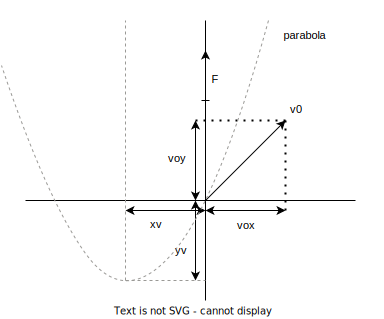

### Zadání

Zjistěte, **jak se pohybuje bodové těleso** ve **stacionárním homogenním silovém poli** (takovým polem může být gravitační nebo elektrostatické pole v určité oblasti prostoru).

- stacionární ($\vec F \neq \vec F(t)$)
	- velikost ani směr síly nezávisí na čase
- homogenní ($\vec F \neq \vec F(\vec n)$)
	- nezávisí na polohovém vektoru
	- velikost a směr síly všude stejné
- předpoklad - $m = \text{konst.}$
	- II. Newtonův zákon (pohybové rovnice)

$\vec F = m \cdot \vec a = m \cdot \frac{d\vec v}{dt}$

- $d\vec v = \frac{F}{m} \cdot dt \quad \text{/integrace}$
- $\displaystyle \int^{\vec v}_{\vec v_{0}} d\vec v = \int^{t}_{0} \frac{\vec F}{m} \, dt = \frac{\vec F}{m} \int^t_{0} dt$

- $\vec F = [0, F, 0]$
- $v_{0} = [v_{0x}, v_{0y}, 0]$

+ $\displaystyle \left[\vec v\right]^{\vec v}_{\vec v_{0}} = \frac{\vec F}{m}\left[t\right]^t_{0}$
+ $\vec v - \vec v_{0} = \frac{\vec F}{m}(t-0)$
+ $\vec v = [v_{x}, v_{y}, 0] = \frac{\vec F}{m}t + \vec v_{o}$
	+ pohyb probíhá v rovině dané vektory $\vec F$ a $\vec v_{0}$

- $v_{x} = \frac{0}{m} \cdot t + v_{0x}$
- $v_{x} = v_{0x}$
- přímočarý rovnoměrný pohyb

+ $v_{y} = \frac{F}{m} \cdot t + v_{0y}$
+ přímočarý rovnoměrně zrychlený pohyb

### Výpočet

$\vec v = \left[ -\frac{m}{F} \cdot v_{ox}v_{oy}; -\frac{m}{2F} \cdot v_{oy}^2\right]$

- $v_{x} = \frac{dx}{dt} \implies x = \int v_{x} \, dt = \int v_{0x} \, dt = v_{0x} \cdot t + x_{0}$
	- $x = v_{0x} \cdot t + x_{0}$
- $v_{y} = \frac{dy}{dt} \implies y = \int v_{y} \, dt = \int \frac{F}{m} \cdot t + v_{0y} \, dt = \frac{F}{2m} \cdot \frac{t^2}{2} + v_{0y} \cdot t + y_{0}$
	- $y = \frac{F}{2m} \cdot t^2 + v_{0y} \cdot t + y_{0}$

### Výsledky

+ pro $t = 0 \implies x_{0} = y_{0} = 0$
	+ $\displaystyle x = v_{0x} \cdot t \to t = \frac{x}{v_{0x}}$
	+ $\displaystyle y = \frac{F}{2m}\left( \frac{x}{v_{0x}} \right)^2 + v_{0y} \cdot \left( \frac{x}{v_{0x}} \right) = \frac{F}{2m \cdot v_{0x}^2} \cdot x^2 + \frac{v_{0y}}{v_{0x}} \cdot x$
		+ výsledek: rovnice paraboly

- hledáme extrém (vrchol) paraboly
- $\displaystyle \frac{dy}{dx} |_{x = x_{v}} = 0$
	- $x_{v}$ - x-ová souřadnice vrcholu

 $\displaystyle\frac{dy}{dx} = \frac{d}{dt}\left[ \frac{F}{2m\cdot v^2_{0x}} \cdot x^2 + \frac{v_{0y}}{v_{0x}} \cdot x \right] = \frac{F}{\cancel{2}m \cdot v^2_{0x}} \cdot \cancel{2} x_{v} + \frac{v_{0y}}{v_{0x}} \cdot 1 = 0$

 $\displaystyle \frac{F}{m \cdot v^{\cancel{2}}_{0x}} \cdot \cancel{2} x_{v} = -\frac{v_{0y}}{\cancel{v_{0x}}}$
 
+ $\displaystyle x_{v} = -\frac{m}{F} \cdot v_{0x} \cdot v_{0y}$
+ $\displaystyle y_{v} = \frac{F}{2m \cdot v_{0x}^2} \cdot x_{v}^2 + \frac{v_{0y}}{v_{0x}} \cdot x_{v} = \dots = -\frac{m}{2F} \cdot v_{0y}^2$