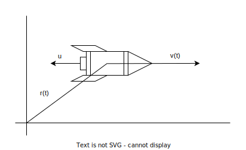

### Zadání

**Raketa o hmotnosti 100 kg** nese **pohonné látky** o hmotnosti **1300 kg**. **Plyny tryskají** z rakety (relativní) **rychlostí 3 km/s**. Určete: **možné zvýšení rychlosti rakety** v kosmickém prostoru.

- $m_{R} = 100 \, \text{kg}$
- $m_{P} = 1300 \, \text{kg}$
- $u = 3 \, \text{km/s}$
- $\Delta v = \, ?$
+ na systém nepůsobí vnější vlivy
+ kosmický prostor $\to$ izolovaný systém $\to$ zákon zachování hybnosti
	- $\vec p = m\cdot \vec v = \text{konst.}$ (hybnost)

hybnost systému ve dvou různých okamžicích musí být stejná
- $p(t) = p(t + dt)$
	- palivo $\mu$ se přemění na plyny, ty uniknou z rakety
	- v čase $t$ platí
		- $p(t) = m(t) \cdot v(t)$
	- v čase $t + dt$ platí
		- $p(t+dt) = m(t+dt) \cdot v(t+dt) + \mu [v(t)-u]$
		-  $\mu$ - hmotnost paliva spáleného za $dt$

dostaneme tedy
+ $m(t) \cdot v(t) = m(t+dt) \cdot v(t+dt) + \mu[v(t)-u]$

dále platí
- $m(t+dt) = m(t) + dm$
- $v(t+dt) = v(t) + dv$
- $\mu = -dm$
- dosazíme do přechozí rovnice

### Výpočet

upravíme vzorec
- $m(t) \cdot v(t) = [m(t)+dm] \cdot [v(t)+dv] -dm[v(t)-u]$
- $\cancel{m(t) \cdot v(t)} = \cancel{m(t) \cdot v(t)} + m(t) \cdot dv + \cancel{dm \cdot v(t)} + dm \cdot dv - \cancel{dm \cdot v(t)} + u \cdot dm$
- $dm \cdot dv$ zanedbáme, velmi malé číslo

upravíme získanou rovnici
- $0 = m(t) \cdot dv + u \cdot dm$
- $udm = - m(t) \cdot dv$
- $\displaystyle \frac{dm}{m(t)} = -\frac{dv}{u}$

provedeme integraci
+ $\displaystyle \int^{m_{R}}_{m_{R}+m_{P}} \frac{dm}{m(t)} = -\frac{1}{u} \int^{v}_{v_{0}} dv$
- $[\ln(m)]^{m_{R}}_{m_{R}+m_{P}} = -\frac{1}{u}[v]^{v}_{v_{0}}$
+ $\ln(m_{R}) - \ln(m_{R}+m_{P}) = -\frac{1}{u}(v-v_{0})$
	- $v-v_{0}=\Delta v$
- $u \cdot \ln\left[ \frac{m_{R}+m_{P}}{m_{R}} \right] = \Delta v$

Ciolkovského rovnice
- $\Delta v = u \cdot \ln\left[ 1 + \frac{m_{P}}{m_{R}} \right]$

### Výsledek

$\Delta v = 3 \cdot \ln\left( 1 + \frac{1300}{100} \right) \, \text{km/s} = 7.92 \, \text{km/s}$