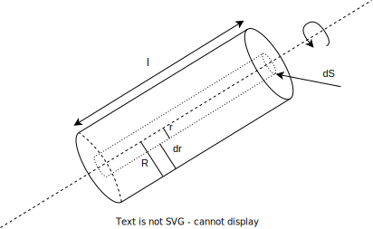

### Zadání

Vypočítejte **moment setrvačnosti homogenního válce** o poloměru **R** a hmotnosti **m** vzhledem k **rotační ose symetrie**.

- homogenní válec $\to \rho = \text{konst.}$ (hustota)
- poloměr $R$
- hmotnost $m$
- moment setrvačnosti $J = \, ?$
+ tloušťka stěny $dr$
+ poloměr trubky $r$
+ délka válce $l$

### Výpočet

- $J = \int dJ = \int_{m} r^2 \cdot dm$
- $dm$ - kolmá vzdálenost rotace od osy rotace
	- $\rho = \frac{dm}{dV} \implies dm = \rho \cdot dV$
- $dV$ - diferenciální objem válce
	- $dV = dS \cdot l = 2\pi r \cdot dr \cdot l$
- $dS$ - diferenciální plocha boční stěny válce
	- $dS = 2\pi r \cdot dr$

$J = \int_{m} r^2 \cdot dm = \int_{V} r^2 \cdot \rho \cdot dV = \int_{0}^{R} r^2 \cdot \rho \cdot 2\pi r \cdot l \cdot dr = \pi \cdot l \cdot \rho \cdot \frac{R^4}{2}$

### Výsledek

$J = \frac{1}{2} \pi \cdot R^2 \cdot l \cdot \rho \cdot R^2 = \frac{1}{2}m \cdot R^2$
- $S = \pi \cdot R^2$
- $v = S \cdot l$
- $m = v \cdot \rho$