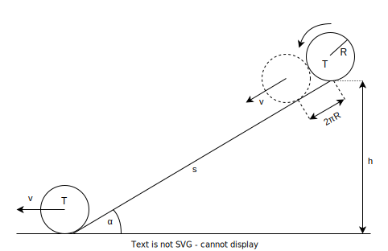

### Zadání

**Homogenní válec** o poloměru **R** a hmotnosti **m** se beze smyku valí po **nakloněné rovině** ve směru spádnice. Délka nakloněné roviny je **s**, úhel jejího sklonu je **α**. V nejvyšším bodě byl válec v klidu a pohybuje se jen vlivem vlastní tíhy. Vypočítejte, jakou **rychlost** bude mít těžiště válce **při opuštění nakloněné roviny**.

- $R$ - poloměr válce
- $m$ - hmotnost válce
- $s$ - délka nakloněné roviny (NR)
- $\alpha$ - úhel sklonu NR
- $v = \, ?$ - rychlost válce

tíhové pole $\to$ konzervativní $\implies$ zákon zachování mechanické energie
- $W_{kin} + W_{pot} = \text{konst.}$
- kinetická + potenciální

výška
+ $\frac{h}{s} = \sin \alpha$
+ $h = \sin \alpha \cdot s$

pro valení válce bez prokluzu platí
- $2\pi R = v \cdot T \quad / \cdot \frac{1}{T} \cdot \frac{1}{R} \qquad (T = \text{perioda})$
- $\displaystyle \frac{2\pi}{T} = \frac{v}{R}$
	- $\frac{2\pi}{T} = \omega \quad (\text{úhlová rychlost})$
+ $J = \frac{1}{2} m R^2$

### Výpočet

upravíme vzorec
- $\emptyset + m \cdot g \cdot h = \left[ \left( \frac{1}{2}m \cdot v^2 \right) + \left( \frac{1}{2}J \cdot \omega^2 \right) \right] + \emptyset$
- $m \cdot g \cdot h = \frac{1}{2}mv^2 + \frac{1}{2}J\omega^2$
	- dosadíme za $h, J, \omega$

upravujeme a poté vyjádříme $v^2$
- $m \cdot g \cdot h = \frac{1}{2}mv^2 + \frac{1}{2}\left( \frac{1}{2}m \cdot R^2 \right)\cdot\left( \frac{v}{R} \right)^2$
- $\cancel{m} \cdot g \cdot h = \frac{1}{2}\cancel{m}v^2 + \frac{1}{4}\cancel{m \cdot R^2} \cdot \frac{v^2}{\cancel{R^2}}$
+ $g \cdot h = \frac{3}{4}v^2 \implies v^2 = \frac{4}{3}gh$

### Výsledek

$v^2 = \frac{4}{3}gh = \frac{4}{3} g \cdot s \cdot \sin \alpha$

$v = \sqrt{ \frac{4}{3} \cdot g \cdot s \cdot \sin \alpha }$