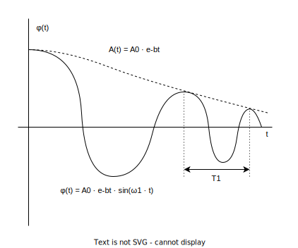

### Zadání

Spočtěte délku matematického sekundového kyvadla, víte-li, že jeho výchylka klesne, nejsou-li hrazeny energetické ztráty, za 5 minut na 1/10. Jakému logaritmickému dekrementu to odpovídá? (Uvažujeme malé kmity)

- $T^M_{kyv} = 1 \, \text{s}$
- $t = 5 \, \text{min}$
- $A(t) = \frac{A_{0}}{10} \to \frac{A_{0}}{A(t)} = 10$
- $\delta = \text{?}$ ... logaritmický dekrement
- obr. z příkladu 9

- $\omega^2_{1} = \omega^2 - b^2$
	- $\omega^2_{1}$ - úhlová frekvence tlumených kyvů
	- $\omega^2 = \frac{g}{l}$ - úhlová frekvence netlumených kyvů
	- $b^2$ - koeficient/faktor útlumu
- $w^2_{1} = \frac{\pi}{T^{kyv}_{1}} = \pi$
	- $T^{kyv}_{1} = 1 \, \text{s}$

### Výpočet

$A(t) = A_{0} \cdot e^{-bt} \implies \frac{A(t)}{A_{0}} = e^{-bt}$

$\ln\left( \frac{A(t)}{A_{0}} \right) = -bt$

$b = -\frac{1}{t} \cdot \ln\left( \frac{A(t)}{A_{0}} \right)$

$b = \frac{1}{t} \cdot \ln\left( \frac{A_{0}}{A(t)} \right)$

$\varphi(t) = A_{0} \cdot e^{-bt} \cdot \sin (\omega_{1}\cdot t)$
- $A_{0} \cdot e^{-bt} = A(t)$

$\displaystyle \pi^2 = \frac{g}{l} - \frac{1}{t^2} \cdot \ln^2\left( \frac{A_{0}}{A(t)} \right)$

$\displaystyle \pi^2 + \frac{1}{t^2} \cdot \ln^2\left( \frac{A_{0}}{A(t)} \right) = \frac{g}{l}$

$\displaystyle l = \frac{g}{\pi^2 + \frac{1}{t^2} \cdot \ln^2\left( \frac{A_{0}}{A(t)} \right)}$

### Výsledek

$\displaystyle l = \frac{9.81}{\pi^2 + \frac{1}{(5 \cdot 60)^2} \cdot \ln^2(10)} \, \text{m} = 0.994 \, \text{m}$