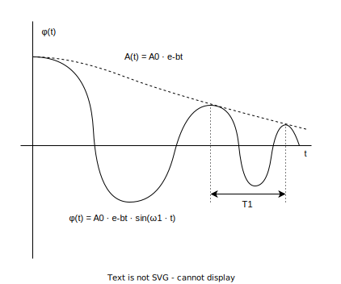

### Zadání

Spočtěte **délku matematického sekundového kyvadla**, víte-li, že jeho **výchylka klesne**, nejsou-li hrazeny energetické ztráty, **za 5 minut na 1/10**. Jakému logaritmickému dekrementu to odpovídá? (Uvažujeme malé kmity)

- $T^M_{k} = 1 \, \text{s}$
- $t = 5 \, \text{min}$
- $\displaystyle A(t) = \frac{A_{0}}{10} \to \frac{A_{0}}{A(t)} = 10$
- délka kyvadla $l = \, ?$
- logaritmický dekrement $\delta = \text{?}$
- obr. z příkladu 9

pro kruhovou frekvenci tlumených kmitů platí
- $\omega^2_{1} = \omega^2 - b^2$
	- $\omega^2_{1}$ - úhlová frekvence tlumených kyvů
	- $\omega^2$ - úhlová frekvence netlumených kyvů
	- $b^2$ - koeficient/faktor útlumu

kruhová frekvence bezztrátového kyvadla (bez tlumení)
- $\displaystyle\omega^2 = \frac{g}{l}$

máme sekundové kyvadlo $\implies T_{1} = 2 \, \text{s}$ (kmit)
- $\displaystyle \omega_{1} = \frac{2\pi}{T_{1}} = \frac{2\pi}{2} = \pi$
	- pro kyv $\implies T = 1 \, \text{s}$

tlumící konstantu určíme z poklesu amplitud
- $\displaystyle\frac{A_{0}}{A(t)} = \frac{1}{e^{-bt}} = e^{bt}$
- $\displaystyle\implies \ln\left( \frac{A_{0}}{A(t)} \right) = bt$
- $\displaystyle\implies b = \frac{1}{t}\cdot \ln\left( \frac{A_{0}}{A(t)} \right)$
- pro $A(t) = \frac{1}{10}A_{0} \implies \frac{A_{0}}{A(t)} = 10$

### Výpočet

dosadíme do vzorce
+ $\omega_{1}^2 = \omega^2 - b^2$
- $\displaystyle\pi^2 = \frac{g}{l} - \frac{1}{t^2} \cdot \ln^2\left( \frac{A_{0}}{A(t)} \right)$
- $\displaystyle \implies l = \frac{g}{\pi^2 + \frac{1}{t^2} \cdot \ln^2\left( \frac{A_{0}}{A(t)} \right)}$

logaritmický dekrement $\delta$
- logaritmus podílu dvou, o periodu posunutých, amplitud
- $\displaystyle\delta = \ln\left[ \frac{A(t)}{A(t+T_{1})} \right] = \ln\left[ \frac{A_{0}\cdot e^{-bt}\cdot \sin(\omega_{1}t)}{A_{0}\cdot e^{-b(t+T_{1})}\cdot \sin[\omega_{1}\cdot(t+T_{1})]} \right] =$
- $\displaystyle= \ln\left[ \frac{\cancel{A_{0}}\cdot \cancel{e^{-bt}}\cdot \cancel{\sin(\omega_{1}t)}}{\cancel{A_{0}}\cdot \cancel{e^{-bt}}e^{-bT_{1}}\cdot \cancel{\sin[\omega_{1}\cdot(t+T_{1})]}} \right] = \ln[e^{bT_{1}}] = b\cdot T_{1}$
- $\displaystyle\delta = \frac{1}{t}\cdot \ln\left( \frac{A_{0}}{A(t)} \right) \cdot T_{1}$

### Výsledek

$\displaystyle l = \frac{9.81}{\pi^2+\frac{1}{5\cdot 60}\cdot \ln^2(10)} = 0.994 \, \text{m}$

$\displaystyle\delta = \frac{1}{5\cdot 60}\cdot \ln\left( 10 \right) \cdot 2 = 0.015$