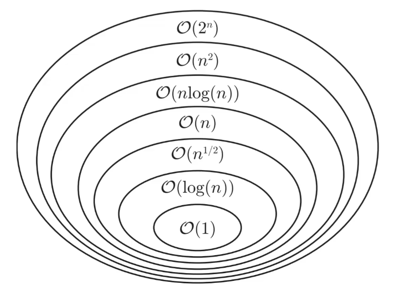

# Výpočetní složitost

- doba výpočtu T(n) v závislosti na vstupu n
	- je důležité určit, co je důležité
	- zajímá nás, co se děje, když n roste
	- různé funkce rostou různě rychle
- druhy algoritmů
	- rychle rostoucí funkce = neefektivní algoritmus
	- pomalu rostoucí funkce =  efektivní algoritmus
- záleží na tom, jestli se funkce vejde pod jinou
	- například lineární pod kubickou
	- ne hned, ale od nějakého $n_0$ ano
	- nezáleží na násobku, jen to $n_{0}$ bude dál

## O-notace

$\mathcal{O}(f(n))$ je množina všech funkcí, pro které platí, že $g(n) < c \cdot f(n)$ pro všechna $n > n_0 > 0$ a nějaké $c > 0$.

- je-li $g(n) \in \mathcal{O}(f(n))$, pak
	- $g(n)$ se vejde pod $f(n)$
	- $g(n)$ neroste rychleji než $f(n)$

**Význam O-notace:**
- omezuje funkci jen shora
- je záruka (**nebude to horší než...**)
- příslušnost do $\mathcal{O}(f(n))$ implikuje **efektivitu**, pokud $f(n)$ roste dost pomalu

U funkcí nezáleží na přenásobení konstantou, přičtení konstanty ani na základu logaritmu:

| pokud                               | platí také                          |
| ----------------------------------- | ----------------------------------- |
| $g(n) \in \mathcal{O}(kf(n))$       | $g(n) \in \mathcal{O}(f(n))$        |
| $g(n) \in \mathcal{O}(k + f(n))$    | $g(n) \in \mathcal{O}(f(n))$        |
| $g(n) \in \mathcal{O}(\log_{a}(n))$ | $g(n) \in \mathcal{O}(\log_{b}(n))$ |

Mezi některými množinami $\mathcal{O}(f(n))$ platí tyto vztahy:

$$
\mathcal{O}(1) \subset \mathcal{O}(\log(n)) \subset \mathcal{O}(\sqrt{n}) \subset \mathcal{O}(n) \subset \mathcal{O}(n \cdot \log(n)) \subset \mathcal{O}(n^2) \subset \mathcal{O}(n^3) \subset \mathcal{O}(2^n) \subset \mathcal{O}(e^n)
$$

U O-notace nezáleží na násobku ani na přičtení konstanty či menší funkce, proto se např. $g(n) = 2 \cdot n^2 + 5 \cdot n + 4$ vejde pod $\mathcal{O}(n^2)$.

## Omega notace

$\Omega(f(n))$ je množina všech funkcí, pro které platí, že $g(n) > c \cdot f(n)$ pro všechna $n > n_0 > 0$ a nějaké $c > 0$. (jediná změna je ve znaménku větší než)

- Omega notace je opakem O-notace
- funkce $g(n)$ patří do $\Omega(f(n))$ když $g(n)$ roste **stejně rychle nebo rychleji** než $f(n)$

Význam Omega notace:
- omezuje funkci jen zdola
- říká, že **to nebude lepší než...**
- příslušnost do $\Omega(f(n))$ implikuje **neefektivitu**, pokud $f(n)$ roste rychle

Mezi Omega množinami existují **obrácené vztahy** oproti O-množinám.

## Theta notace

Pokud $g(n) \in \mathcal{O}(f(n))$ a zároveň $g(n) \in \Omega(f(n))$, pak $g(n) \in \Theta(f(n))$.
- neroste rychleji ani pomaleji - roste stejně rychle
- graf $g(n)$ je od jistého $n_{0}$ možné uzavřít mezi grafy $c_{1} \cdot f(n)$ a $c_{2} \cdot f(n)$
	- patrně $c_{1} < c_{2}$

Theta množiny jsou disjunktní - funkce **nemůže patřit do více množin zároveň**.

Výjimka: Pokud $g_{1}(n) = 1000n, g_{2}(n) = n\log(n)$, pak pro všechna realistická n platí $g_{2}(n) < g_{1}(n)$, protože funkce $g_{1}$ bude efektivnější až ve **velmi velkých číslech**.

## Důležitá poznámka

Význam funkcí může být:
- čas výpočtu pro jakýkoli vstup velikosti n
- čas výpočtu pro nejlepší možný vstup velikosti n
- čas výpočtu pro nejhorší možný vstup velikosti n
- průměrný čas výpočtu pro vstup velikosti n
- počet instrukcí pro ...
- množství paměti nutné pro zpracování ...
- ...

Je ale potřeba nesrovnávat hrušky s pomeranči.
- Jeden program může mít **v očekávaném případě lepší efektivitu** než jiný **v tom nejhorším případě**, přesto však ten první nemusí být lepší (v nejhorším případě může být mnohem méně efektivní).

## Určení výpočetní složitosti programu

- je potřeba určit funkci $g(n)$
- při určování můžeme zanedbat časy jednotlivých instrukcí, **pokud jsou opravdu konstatní** (nezávislá na parametru n)
- výpočetní složitost neřeší rozdílné výkony počítačů